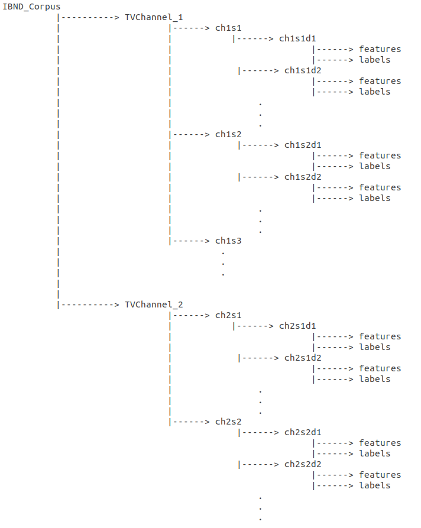

# Indian-Broadcast-News-Debate-IBND-Corpus

The Indian Broadcast News Debate (IBND) corpus is created by collecting news debates from two popular English Indian news channels The corpus contains audio data of 15 TV news debates obtained from two Indian English news channels. The total duration of the corpus is 12 hours and 47 minutes. The corpus contains 94 unique speakers
(83 male and 11 female), excluding field reporters. The typical duration of each debate varies from 20 to 60 minutes. The IBND corpus consists of annotations for shouted, overlapped and competitive speech. The Praat phonetic software was used to perform the annotations. A total of 45 annotators were involved in the annotation
procedure of shouted and overlapped speech. Multiple annotators annotated each audio interval to minimize subjective bias. The statistics generated from
the final annotations indicate that there is significant presence of shouted, overlapped, and competitive speech in the IBND corpus. 

Due to copyright issues, sharing the audio data from the IBND corpus is not possible. However, you can access details of the debates, such as their names, durations, and YouTube links, in the "IBND_Dataset_Details.csv" file. To download the audio data of the IBND corpus, use the "downloader.py" script using the following command:

python downloader.py <output_Path> <SegmentDuration_min>

Ensure that the value for <SegmentDuration_min> is set to 10, as annotations are provided for each 10-minute non-overlapping segment. Please be aware that some of the links may no longer be active. 
The annotation files, provided in the "*.Textgrid" format, contain ground truth labels for shouted-normal speech (Tier-1), overlapped-single speaker's speech (Tier-2), and competitive-non-competitive speech (Tier-3). These annotation files can be found within the "IBND_Annotations" directory.

In addition, different speech features extracted from IBND corpus along with annotations are available at the following Zenodo link

Zenodo Link: https://doi.org/10.5281/zenodo.8161172

More details of the corpus can be found in the paper (Link to the paper will be updated soon)  

# Audio Specifications
- Sampling Rate: 16 kHz
- Number of channels: 1

# Audio Features Specifications
- Frame size: 25 ms
- Frame shift: 10 ms

# Corpus Directory Structure
Directory structure of the corpus is as follows:

Here, TVChannel_1 and TVChannel_2 are the source channels of TV debates. Notation ch1s1 denotes show-1 (s1) of channel-1 (ch1) and ch1s1d1 represents debate-1 (d1) obtained from show-1 (s1) of channel-1 (ch1). Similar notations are used in the directory structure.   

Every debate folder contains two sub-folders, i.e., "features" and "labels". The "features" folder contains 9 different speech features extracted from IBND corpus for each 25 ms frame with a shift of 10 ms. These feaures are:

- Discrete Cosine Transform of Integrated Linear Prediction Residual (dctilpr)
- Mel-Power Difference of Spectrum in Sub-bands (mpdss)
- Residual Mel-Frequency Cepstral Coefficient (rmfcc)
- Log Spectrogram (logSpec)
- Log Spectrogram of Integrated Linear Prediction Residual (logSpecILPR)
- Instantaneous Frequency Cosine Coefficient (ifcc)
- Modified Group Delay Cepstral Coefficient (mgdcc) 
- Mel-Frequency Cepstral Coefficient extracted from pre-emphasized speech (mfcc_preemphasizedSpeech)
- Mel-Frequency Cepstral Coefficient extracted from raw speech (mfcc_without_preemphasizedSpeech)

Details of these features can be found in the following papers:

For dctilpr, mpdss, rmfcc and mfcc_preemphasizedSpeech features: Shikha Baghel, S. R. Mahadeva Prasanna, Prithwijit Guha; Exploration of excitation source information for shouted and normal speech classification. J Acoust Soc Am 1 February 2020; 147 (2): 1250–1261. https://doi.org/10.1121/10.0000757

For logSpec and logSpecILPR features: Baghel, S., Bhattacharjee, M., Prasanna, S.R.M., Guha, P. (2021) Automatic Detection of Shouted Speech Segments in Indian News Debates. Proc. Interspeech 2021, 4179-4183, doi: https://www.isca-speech.org/archive/interspeech_2021/baghel21_interspeech.html

For ifcc, mgdcc and mfcc_without_preemphasizedSpeech features: Shikha Baghel, S. R. Mahadeva Prasanna, Prithwijit Guha; Overlapped speech detection using phase features. J Acoust Soc Am 1 October 2021; 150 (4): 2770–2781. https://doi.org/10.1121/10.0006614 

 The "labels" folder contains three sub-folders:
 - Shout_info: contains shouted vs. normal speech annotations. Shout label is denoted by 1 and 0 label is used for normal speech. 
 - Overlap_info: contains overlapped vs. single speaker's speech annotations. Overlap label is denoted by 1 and 0 label is used for  single speaker's speech. 
 - Cmp_info: contains competitive speech vs. others annotations. competitive label is denoted by 1 and 0 label is used for "others" class. Here, "others" class comprises non-competitive speech and single speaker's speech.

 Feel free to reach out to me (shikhabaghel@nitk.edu.in or shikhabaghel1990@gmail.com) for further information.

                                                .                                                              

